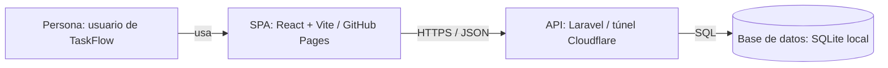

# TaskFlow — Frontend

Tablero Kanban desarrollado con React. Permite registrarse, iniciar sesión, crear tareas, avanzar su estado y eliminarlas. Los datos se guardan en la API Laravel del equipo.

## Integrantes

- Neicer Jimenez — [@CeoF10](https://github.com/CeoF10)
- Anthony Ramirez — [@anthonyramirez-dotcom](https://github.com/anthonyramirez-dotcom)
- Sebastian Velastegui — [@eliasvelastegui81-cpu](https://github.com/eliasvelastegui81-cpu)

## Tecnologías

React 18, Vite 5, React Router 6 y Axios. El estado de las tareas vive en `Board`; `Column` y `TaskCard` reciben sus datos y acciones mediante props.

## Instalación y ejecución

```bash
npm install
cp .env.example .env
npm run dev
```

Abre http://localhost:5173. El backend debe estar iniciado en el puerto 8000. Para una instalación existente, conserva tu `.env`.

## Publicación

Sitio del equipo: https://eliasvelastegui81-cpu.github.io/TMO-Fronted/

Backend: https://github.com/CeoF10/taskflow-backend

API de la práctica: https://leon-camping-granny-agreed.trycloudflare.com/api

`src/services/api.js` lee `VITE_API_URL`. En local se configura en `.env`; en GitHub Pages se configura como **variable de Actions** del repositorio, con `/api` al final. Cada push a `main` genera y publica `dist/` automáticamente.

```bash
npm run build
npm run preview
```

`HashRouter` permite recargar las rutas en Pages. La API pública depende del túnel de Cloudflare y de la computadora que ejecuta Laravel. Si cambia la URL del túnel, actualiza la variable y ejecuta otra vez el workflow de despliegue.

## Arquitectura



## Comprobación del flujo

Registrar un usuario, cerrar sesión, iniciar sesión, crear una tarea, avanzar su estado y recargar. Después eliminarla y recargar para comprobar que no vuelve. Sin sesión, `/#/dashboard` debe redirigir a `/#/login`.
